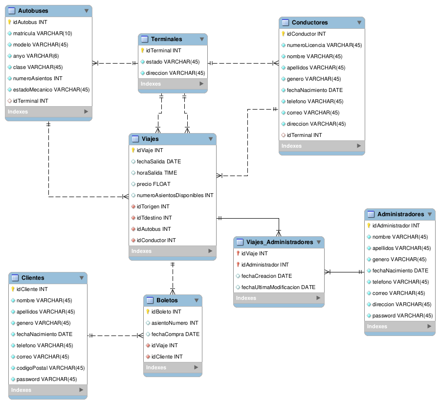

# busTickets JavaScript

Desarrollo de una aplicación para la venta de boletos de autobús utilizando Mongo, Express, React, NodeJS.

Etapa I. Backend.

## Autobuses M

“Autobuses M” se dedica al transporte de pasajeros de un estado a otro en México. Tiene terminales en diferentes estados de la República, dichas terminales son origen y destino de sus viajes. Cada terminal tiene adscritos un conjunto de autobuses y un conjunto de conductores, los cuales son asignados a cada viaje según su disponibilidad y de manera independiente unos de otros. Los viajes son programados con origen, destino, autobús, conductor, fecha de salida, hora de salida y precio. El precio del boleto se establece al programar el viaje (lo asigna el administrador dependiendo de diferentes factores). Los autobuses tienen 40, 30 o 20 asientos según su tipo (convencional, plus o plusplus). 

Otras características importantes que se deben almacena son el modelo y año del autobús, su matrícula y su estado mecánico (operativo o en mantenimiento). Los clientes deben registrarse en la página con su información: nombre, apellidos, correo electrónico, teléfono, fecha de nacimiento, código postal, género y password. La información que se guarda de los conductores es la misma que la de los clientes, a excepción del password, además en lugar del código postal se registra la dirección completa y su número de licencia. 

Se requiere que el administrador del sistema pueda gestionar toda la información y en particular registrar nuevos viajes, también se requiere que el usuario pueda registrarse y comprar boletos (implica la selección de un asiento y la generación de un boleto), manteniendo un registro histórico de los boletos que ha comprado. Los clientes pueden actualizar su información, ver sus boletos actuales o anteriores pero no pueden cancelarlos ni cambiarlos, estas tareas unicamente las puede hacer un administrador. 

Por lo general para cada viaje de ida hay uno de regreso en el mismo autobús y con el mismo conductor, a menos que uno de los dos esté imposibilitado para hacer el viaje. Los dos viajes se establecen al mismo tiempo por un administrador. De los viajes también se debe guardar la fecha en que fue creado y modificado por última vez, así como el administrador que hizo la última modificación. La información guardada de los administradores es la misma que la de los conductores a excepción del número de licencia.

